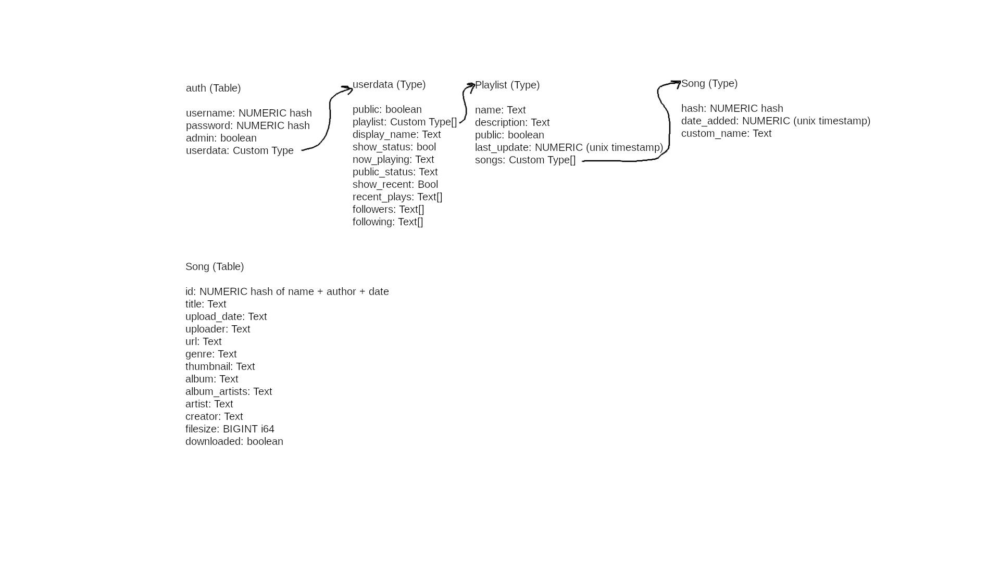

<h3 align="center">
	 
		seanify
	 
</h3>

music player

	

Disclaimer: this project is in no way affiliated with spotify, nor is it trying to replicate the scale of it

I've had spotify premium for the past few months and it's great. I have all my music on a trusted platform that has a friend account system, playlist storage, local storage, and everything you'd expect from a music streaming service.

Cool, now imagine all that but the platform is really awful and untrusted (and no one uses it). That is seanify.

For what spotify premium is I feel it's relatively expensive and it's always fun to make your own stuff so I've started this project. I have a few spare servers laying around so may as well. Plus the name sounds cool.

###### Currently in it's really early stages, don't even try to run it unless you'd like to contribute.

This is just the backend of the application, these "features" are assuming the client has the ability to take in the data from the server and use it. It is ONLY displaying the capabilities of the backend.
Writing clients is the next step after the backend is mostly complete. I plan on using [react native](https://reactnative.dev/).

If you have any experience with rust or react help would be appreciated!

##### features
* Create accounts (and admin accounts) ✓
* Stream music from a library on a server ✓
* Download music from a library on a server ✓
* User auth/login system ✓
* Download single videos (soon playlist too) from youtube via yt-dlp + aria2c ✓
* Control different players from instances under the same account ✓ (ex: control playback on Desktop from phone)
* Public profiles, playlist, followers
* Postgresql data recovery/backup system of some sort, not sure since I'm new to sql/postgres
* Small tui client in js
* Usable gui client in react native
* Download music from Soundcloud

##### ideals
* client app is relatively simple
* able to support a few hundred people (not really built for a ton of scaling in mind)
* despite the lack of ambition with scaling, I want it to be relatively fast/lightweight
* big focus on keeping user data private where it can be
* personally learn how to use sql, improve with react/ts/js and have fun with rust :)

##### How it works

###### database layout

as you can tell from the highly advanced database schema this is a top of the line streaming service /s 

</img>

All communication with clients are done through websockets (soon to be TLS after I figure out how to generate the keys correctly). A lot of the data sent back and forth is plaintext which allows for writing a simple client in many cases.

During runtime not a ton of data is stored of each user, in rust the only data stored is if the currently connected websocket connections are authenticated, a hash of the username, and if they're admin accounts. 

All userdata is OPTIONAL, playlist (will be hopefully) can be only client side and never contact the server except to download or stream.

Soon IPs will be stored only temporarily in memory to provide a ratelimit on websocket calls.

###### authentication

When a new websocket client first connections if the first message sent over the socket is not either "AUTH username password" or "SIGN username password INSTANCE_KEY" the connection is closed. 

usernames and passwords are hashed and might be hashed client side for extra security because more hashing is always better ofc. 

When a signup request is sent, if there is a 5th argument that happens to be equal to the `ADMIN_KEY` env variable it creates an admin account. This will have more implications in the future™️.

`INSTANCE_KEY` is a configured value that prevents users who don't know it from making accounts or downloading music, think of an additional password.

###### streaming 

My previous descriptions may have been slightly misleading, "streaming" does work, as you can download the music and play it back while it's downloading. Obviously you need to create a client to do this (future problem™️). Music files are hosted at /`INSTANCE_KEY` relative to the root url of the websocket.
For example, over lan, let's say that the INSTANCE_KEY is set to hello.
Music files can be accessed at `127.0.0.1:8080/hello/hash_of_song`. 

The Hash of the song will be obtained from either a database lookup or a lookup on a plain text mini copy of the database on each client (allows faster searches).

###### control playback from different instances

When certain commands are sent over the websocket all websocket clients that have the same username hash as the client that sent it are sent the command as well. There is no limit to how many instances you can have running at the same time on the same account (might add one soon). 

###### public profile

This part is still in early development but data is synced to the server based on the client and can display similar to Discord/spotify. If you have a question about any of the userdata types please contact me! 

ofc the public profile is entirely optional

##### Setup
lmao hf

If you would like to contribute please message me on Discord at NotCreative#9884, I'll give more detailed instructions on setup or if you have any suggestions please let me know.

Or you can raw dog it and attempt to figure it out yourself, all power to you. The provided Makefile has some setup commands.

##### LICENSE
GPL V3, if you would like this to be discussed please contact me.

 
 

Found a spelling mistake? Fix it in a PR or contact me on Discord!
